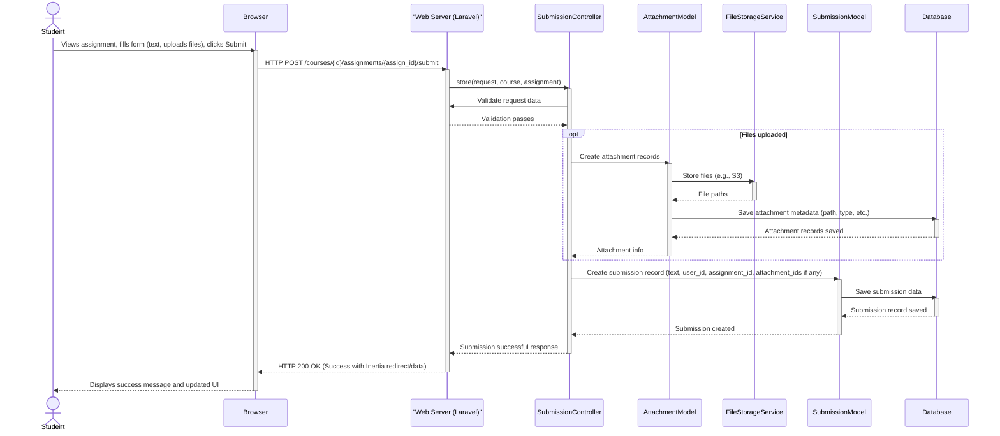
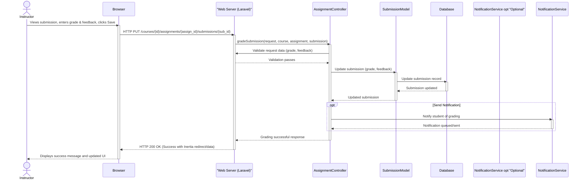

# Mermaid Diagram Codes

This file contains the Mermaid code for various diagrams representing the ENSIASD E-Learning Platform. These diagrams can be rendered using tools that support Mermaid syntax (e.g., online editors, IDE extensions, documentation generators).

## Entity-Relationship Diagram (ERD)

The following Mermaid code describes the structure of the database, including entities (tables), their attributes, primary keys (PK), foreign keys (FK), and the relationships between them.

```mermaid
erDiagram
    users {
        int id PK
        string name
        string username
        string email
        string avatar
        string role
        datetime profile_completed_at
        datetime created_at
        datetime updated_at
    }

    instructor_profiles {
        int id PK
        int user_id FK
        text bio
        string expertise_areas
        string social_links
        datetime created_at
        datetime updated_at
    }

    courses {
        int id PK
        int instructor_id FK
        string title
        text description
        string image
        string code
        string invite_token
        string color
        string category
        string status
        datetime published_at
        datetime created_at
        datetime updated_at
    }

    chapters {
        int id PK
        int course_id FK
        string title
        text description
        int position
        datetime created_at
        datetime updated_at
    }

    resources {
        int id PK
        int chapter_id FK
        string title
        string resource_type
        int position
        string metadata "JSON"
        datetime created_at
        datetime updated_at
    }

    rich_text_resources {
        int id PK
        int resource_id FK
        text content
        string format
        datetime created_at
        datetime updated_at
    }

    attachment_resources {
        int id PK
        int resource_id FK
        datetime created_at
        datetime updated_at
    }

    external_resources {
        int id PK
        int resource_id FK
        string external_url
        string link_title
        datetime created_at
        datetime updated_at
    }

    course_enrollments {
        int id PK
        int user_id FK
        int course_id FK
        datetime enrolled_at
        datetime completed_at
        datetime created_at
        datetime updated_at
    }

    assignments {
        int id PK
        int course_id FK
        string title
        text description
        string type
        datetime due_date
        int points_possible
        bool published
        datetime created_at
        datetime updated_at
    }

    submissions {
        int id PK
        int assignment_id FK
        int user_id FK
        datetime submitted_at
        bool is_late
        string status
        decimal grade
        text feedback
        datetime created_at
        datetime updated_at
    }

    attachments {
        int id PK
        string attachable_type "Polymorphic: e.g., Assignment, Submission"
        int attachable_id "Polymorphic ID"
        string filename
        string path
        string mime_type
        int size
        datetime created_at
        datetime updated_at
    }

    quiz_questions {
        int id PK
        int assignment_id FK "Nullable"
        int resource_id FK "Nullable"
        text question
        int position
        int points
        datetime created_at
        datetime updated_at
    }

    quiz_options {
        int id PK
        int quiz_question_id FK
        text option_text
        bool is_correct
        datetime created_at
        datetime updated_at
    }

    quiz_answers {
        int id PK
        int submission_id FK
        int quiz_question_id FK
        int quiz_option_id FK "Nullable"
        text answer_text "Nullable"
        datetime created_at
        datetime updated_at
    }

    announcements {
        int id PK
        int course_id FK
        int user_id FK
        text content
        datetime created_at
        datetime updated_at
    }

    announcement_comments {
        int id PK
        int announcement_id FK
        int user_id FK
        text content
        datetime created_at
        datetime updated_at
    }

    course_threads {
        int id PK
        int course_id FK
        int author_id FK
        string title
        text content
        bool is_pinned
        datetime created_at
        datetime updated_at
    }

    thread_comments {
        int id PK
        int thread_id FK
        int author_id FK
        text content
        int parent_id FK "Nullable, self-referencing"
        datetime created_at
        datetime updated_at
    }

    home_content {
        int id PK
        string title
        text content
        string background_image
        string image
        string link1
        string link2
        datetime created_at
        datetime updated_at
    }

    about_content {
        int id PK
        string hero_title
        text mission_content "etc."
        datetime created_at
        datetime updated_at
    }

    contact_content {
        int id PK
        string school_name
        string address
        string phone
        string email
        datetime created_at
        datetime updated_at
    }

    users ||--|| instructor_profiles : "has"
    users |o--o{ courses : "enrolls (student)"
    users ||--o{ course_enrollments : "has"
    courses ||--o{ course_enrollments : "has"
    users ||--o{ courses : "creates (instructor)"
    users ||--o{ course_threads : "authors"
    users ||--o{ thread_comments : "authors"
    users ||--o{ submissions : "submits"
    users ||--o{ announcements : "creates_author"
    users ||--o{ announcement_comments : "creates_author_comment"

    courses ||--o{ chapters : "has"
    courses ||--o{ course_threads : "contains"
    courses ||--o{ announcements : "has_course_announcements"
    courses ||--o{ assignments : "contains_assignments"

    chapters ||--o{ resources : "contains_resources"

    resources ||--|| rich_text_resources : "is_rich_text"
    resources ||--|| attachment_resources : "is_attachment_collection"
    resources ||--|| external_resources : "is_external_link"
    resources ||--o{ quiz_questions : "contains_quiz_questions_resource"

    attachment_resources |o--o{ attachments : "has_files" // Polymorphic: AttachmentResource can have many attachments

    assignments ||--o{ submissions : "has_submissions"
    assignments |o--o{ attachments : "has_instruction_files" // Polymorphic: Assignment can have many attachments
    assignments ||--o{ quiz_questions : "is_quiz_assignment"

    submissions |o--o{ attachments : "has_submission_files" // Polymorphic: Submission can have many attachments
    submissions ||--o{ quiz_answers : "contains_quiz_answers"

    quiz_questions ||--o{ quiz_options : "has_options"
    quiz_questions ||--o{ quiz_answers : "has_answers_to_question"
    quiz_options |o--o| quiz_answers : "is_selected_option_for"

    announcements ||--o{ announcement_comments : "has_comments"
    announcements |o--o{ attachments : "has_announcement_attachments" // Polymorphic

    announcement_comments |o--o{ attachments : "has_comment_attachments" // Polymorphic

    course_threads ||--o{ thread_comments : "has_thread_comments"
    course_threads |o--o{ attachments : "has_thread_attachments" // Polymorphic

    thread_comments |o--o{ attachments : "has_comment_attachments_thread" // Polymorphic
    thread_comments }o--o| thread_comments : "replies_to"

```

## Use Case Diagrams

This section provides Mermaid code for Use Case diagrams, illustrating the interactions between different actors (Student, Instructor, Administrator) and the system.

### Student Use Case Diagram

```mermaid
useCaseDiagram
    actor Student

    Student --> (Register for an account)
    Student --> (Log in / Log out)
    Student --> (Complete/Update Profile)
    Student --> (View email verification status)

    Student --> (View Course Catalog / Public Course Listings)
    Student --> (Enroll in Course)
    Student --> (View Enrolled Courses Dashboard)
    Student --> (Access Course Content)
    Student --> (Download Course Attachments)

    Student --> (View Course Announcements)
    Student --> (Comment on Announcements)
    Student --> (Participate in Course Discussions)
    Student --> (Create new discussion threads)
    Student --> (Post replies to threads)

    Student --> (View Assignments)
    Student --> (Submit Assignment)
    Student --> (Take Quizzes)
    Student --> (View Grades and Feedback)
    Student --> (Track overall course progress)
```

### Instructor Use Case Diagram

```mermaid
useCaseDiagram
    actor Instructor

    Instructor --> (Register for an account)
    Instructor --> (Log in / Log out)
    Instructor --> (Complete/Update Profile with Instructor Details)

    Instructor --> (Create New Course)
    Instructor --> (Edit Existing Course Details)
    Instructor --> (Manage Course Status - Draft, Publish, Archive)
    Instructor --> (Add/Edit/Delete/Reorder Course Chapters)
    Instructor --> (Add/Edit/Delete/Reorder Course Resources)
    
    Instructor --> (View Enrolled Students)
    Instructor --> (Manage Student Enrollment Status)
    Instructor --> (Generate/View Course Invite Codes and Links)

    Instructor --> (Create New Assignment)
    Instructor --> (Edit/Delete Assignments)
    Instructor --> (Publish/Unpublish Assignments)
    Instructor --> (View Student Submissions)
    Instructor --> (Grade Submissions)
    
    Instructor --> (Create New Quiz)
    Instructor --> (Add/Edit/Delete Quiz Questions and Options)
    Instructor --> (Manage Quiz settings)

    Instructor --> (Post Course Announcements)
    Instructor --> (Edit/Delete Announcements)
    Instructor --> (View/Manage Comments on Announcements)
    Instructor --> (Moderate Course Discussions)

    Instructor --> (View Instructor Dashboard and Analytics)
```

### Administrator Use Case Diagram

```mermaid
useCaseDiagram
    actor Administrator

    Administrator --> (Log in / Log out)

    Administrator --> (Manage Homepage Content)
    Administrator --> (Manage About Page Content)
    Administrator --> (Manage Contact Page Content)
    Administrator --> (Manage Publications / Site-wide Announcements)

    Administrator --> (Manage User Accounts - Potential)
    Administrator --> (Manage Course Categories - Potential)
    Administrator --> (Configure System-wide Settings - Potential)
    Administrator --> (View System Health/Logs - Potential)
```

## Sequence Diagrams

This section provides Mermaid code for selected Sequence Diagrams, detailing specific user interactions and system processes.

### Sequence Diagram: Student Submits Assignment



### Sequence Diagram: Instructor Grades Submission



### Sequence Diagram: User Authentication (Login)

```mermaid
sequenceDiagram
    actor User
    participant Browser
    participant LaravelApp as "Web Server (Laravel)"
    participant LoginController
    participant UserModel
    participant SessionService
    participant Database

    User->>Browser: Enters email and password, clicks Login
    activate Browser
    Browser->>LaravelApp: HTTP POST /login
    activate LaravelApp
    LaravelApp->>LoginController: store(request)
    activate LoginController
    LoginController->>LaravelApp: Validate credentials format
    LaravelApp-->>LoginController: Validation passes
    LoginController->>Database: Attempt to authenticate user (check credentials against UserModel)
    activate Database
    Database-->>LoginController: Authentication success/failure
    deactivate Database
    alt Authentication Successful
        LoginController->>SessionService: Start/Regenerate session
        activate SessionService
        SessionService-->>LoginController: Session started
        deactivate SessionService
        LoginController-->>LaravelApp: Authentication successful, redirect to dashboard
        LaravelApp-->>Browser: HTTP 302 Redirect (to dashboard) with session cookie
        deactivate LoginController
        deactivate LaravelApp
        Browser->>LaravelApp: HTTP GET /dashboard (following redirect)
        activate LaravelApp
        LaravelApp-->>Browser: HTTP 200 OK (Dashboard page via Inertia)
        deactivate LaravelApp
        Browser-->>User: Displays Dashboard
    else Authentication Failed
        LoginController-->>LaravelApp: Authentication failed
        deactivate LoginController
        LaravelApp-->>Browser: HTTP 200 OK (Login page with error messages via Inertia)
        deactivate LaravelApp
        Browser-->>User: Displays login error message
    end
    deactivate Browser
```
