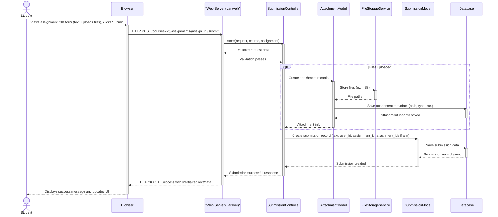
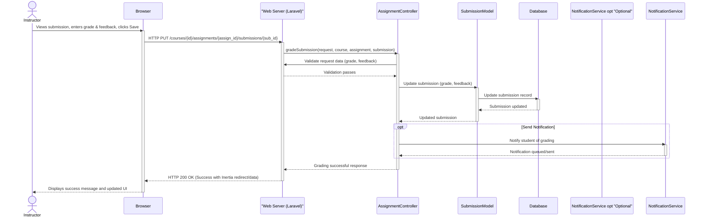

# Final Project Report: ENSIASD E-Learning Platform

## Introduction

This report documents the features, system design, and technical aspects of the ENSIASD E-Learning Platform. The information presented is based on a thorough analysis of the project's existing codebase, including its backend (Laravel) and frontend (React with Inertia.js) components, database schema, and various configuration files. The purpose is to provide a comprehensive overview of the platform in its current state, covering both user-facing functionalities and underlying technical foundations.

## Project Overview

The project is an E-Learning Platform developed for ENSIASD Taroudant, a higher education institution. Its primary purpose is to provide a comprehensive and interactive online learning environment for both instructors and students. The platform aims to streamline the educational process by enabling instructors to easily create, manage, and deliver diverse educational content, including course materials, assignments, and quizzes. For students, it offers a centralized hub to access courses, track their academic progress, submit assignments, and actively participate in course-related discussions and announcements.

The target audience for this platform comprises the instructors and students of ENSIASD Taroudant. The system is designed to cater to their distinct needs within the educational ecosystem.

Key functionalities of the E-Learning Platform include:

*   **Course Creation and Management:** Instructors can design courses, organize them into chapters, and upload various types of resources (files, rich text, external links).
*   **Assignment Handling:** Creation of assignments by instructors, submission by students, and subsequent grading capabilities.
*   **Quiz Administration:** Tools for creating and managing quizzes within courses to assess student understanding.
*   **Student Enrollment and Management:** Mechanisms for students to enroll in courses (e.g., via course codes or invite links) and for instructors to manage enrolled students.
*   **Communication Tools:** Features for announcements within courses and discussion forums to facilitate interaction between students and instructors.
*   **Public-Facing Website:** A website presenting information about the institution and its offerings, with pages such as Home, About, Courses, Publications (likely announcements or news), and Contact.
*   **User Roles:** The platform defines distinct user roles:
    *   **Student:** Accesses course content, submits assignments, participates in discussions.
    *   **Instructor:** Creates and manages courses, delivers content, grades assignments, interacts with students.
    *   **Administrator:** (Implied) Manages the content of the public-facing website (Home, About, Contact pages, etc.), and likely oversees general platform settings and user management.

## Technical Specifications

This section outlines the technical architecture and key components of the ENSIASD Taroudant E-Learning Platform.

-   **Backend:**
    *   Framework: Laravel 12 (PHP 8.2+)
    *   Key Libraries:
        *   `inertiajs/inertia-laravel`: For integrating the React frontend with the Laravel backend.
        *   `league/flysystem-aws-s3-v3`: For S3 file storage.
        *   `prism-php/prism`: Server-side syntax highlighting.
        *   `tightenco/ziggy`: Enables usage of Laravel named routes in JavaScript.

-   **Frontend:**
    *   Framework/Library: React 19 (using TypeScript)
    *   Integration: Inertia.js is used to build this single-page application (SPA) experience with server-side routing and controllers.
    *   Key Libraries:
        *   `@tiptap/react` & Tiptap extensions: For a rich text editor experience.
        *   `@dnd-kit/core` & `@dnd-kit/sortable`: For drag and drop functionality.
        *   `recharts`: For displaying charts (e.g., in instructor dashboards).
        *   `zod` & `zod-form-data`: For schema validation.
        *   `date-fns`: For date utility functions.
        *   `sonner`: For toast notifications.
        *   `react-dropzone`: For file uploads.
        *   `cmdk`: Command menu component.
        *   `embla-carousel-react`: Carousel component.
        *   `framer-motion`: For animations.

-   **Database:**
    *   Default (Development): SQLite (as configured in `config/database.php` and `composer.json` post-install script).
    *   Supported Production Databases: MySQL, PostgreSQL, MariaDB, SQL Server (as listed in `config/database.php`).
    *   Redis is also configured for caching and potentially other uses.

-   **Styling:**
    *   CSS Framework: Tailwind CSS (Version 4).
    *   UI Components: The project heavily utilizes Radix UI primitive components (e.g., `@radix-ui/react-accordion`, `@radix-ui/react-dialog`, etc.) and Lucide Icons (`lucide-react`). This component structure, found under `resources/js/components/ui`, is characteristic of component libraries like Shadcn UI, which are built on these primitives.
    *   Utility Libraries: `class-variance-authority`, `clsx`, `tailwind-merge` for managing CSS classes.
    *   Animations: `tailwindcss-animate`.

-   **API:**
    *   The application primarily functions as a web application using server-side rendering via Inertia.js.
    *   There is no dedicated `routes/api.php` file for token-based API routes. Specific interactions, such as quiz generation (`POST /quiz/generate`), are handled via web routes defined in `routes/web.php`, likely as AJAX requests within the authenticated session.

-   **Build Tool:**
    *   Vite: Used for frontend asset bundling and development server, configured in `vite.config.mjs`.

-   **Version Control:**
    *   Git: Inferred from the presence of `.git` related files and common development practices.

-   **Server Environment (General Assumption):**
    *   A standard PHP server environment, such as Nginx or Apache with PHP-FPM, is required to host the Laravel backend.
    *   A Node.js environment is necessary for the frontend build process.

## Non-Technical Specifications

This section outlines the E-Learning Platform's functionalities from a user perspective, detailing user roles and the core features available to them.

### 1. User Roles

The platform defines three primary user roles, each with specific capabilities:

*   **Student:**
    *   **Course Interaction:** Enrolls in available courses using course codes or invite links. Accesses all published course materials, including chapters, uploaded resources (documents, videos, links), and embedded rich text content.
    *   **Assignments & Quizzes:** Submits assignments as per instructor requirements (potentially including text and file uploads). Takes quizzes designed to assess understanding of course content.
    *   **Communication:** Participates in course-specific discussion forums by creating new threads or commenting on existing ones. Views course announcements made by instructors and can comment on them.
    *   **Progress & Profile:** Tracks their progress and grades for assignments and quizzes (implied by submission and grading features). Manages their personal profile information (name, avatar, etc.).

*   **Instructor:**
    *   **Course Management:** Creates new courses, providing details such as title, description, image, category, and a unique color theme. Organizes courses into reorderable chapters. Adds and manages diverse learning resources within chapters (rich text, file attachments, external web links). Controls course status (draft, published, archived).
    *   **Assessment Management:** Creates, edits, and manages assignments with detailed instructions, due dates, and optional attachments. Develops and administers quizzes with various question types and options.
    *   **Student Interaction & Grading:** Views student submissions for assignments. Provides grades and textual feedback on submissions.
    *   **Communication & Engagement:** Posts course-specific announcements to students, which can include content and attachments. Manages and participates in course discussion forums.
    *   **Enrollment Management:** Manages student enrollments within their courses, including the ability to remove students if necessary.
    *   **Dashboard & Analytics:** Accesses a dedicated dashboard providing statistics on their courses, such as total student numbers, active student counts, enrollment trends over time, and distribution of resource types used.
    *   **Profile Management:** Manages their personal and professional profile information.

*   **Administrator (Inferred):**
    *   **Public Website Content Management:** Manages the content of the public-facing website pages, including the Home page (e.g., hero section text, images, links), About page (mission, vision, features, stats), Contact page (contact details, map), and Publications/Announcements page. This is managed through a dedicated interface in the backend.
    *   **System Oversight (Potential):** While not explicitly detailed in the reviewed files, an administrator role typically includes managing user accounts (students, instructors), system-wide settings, categories, and overall platform health and maintenance.

### 2. Core Features

The platform offers a comprehensive suite of features designed to facilitate online learning and teaching:

*   **User Authentication & Authorization:**
    *   Secure user registration and login mechanisms.
    *   Password management (e.g., reset functionality).
    *   Role-based access control, ensuring users only access features relevant to their role.
    *   A profile completion step for new users to ensure necessary information is provided.

*   **Course Creation & Management:**
    *   Instructors can create courses with comprehensive details: title, description, cover image, category, display color, and status (draft, published, archived).
    *   Automatic generation of unique course codes and shareable invite tokens for easy student enrollment.
    *   Courses can be structured into logical chapters, which instructors can reorder as needed.
    *   A variety of resource types can be added to chapters:
        *   **Rich Text:** For creating formatted textual content directly on the platform.
        *   **Attachments:** For uploading files (documents, presentations, media).
        *   **External Links:** For linking to external web resources.

*   **Assignment Management:**
    *   Instructors can create assignments with titles, detailed instructions, specific due dates, and attach relevant files.
    *   Control over assignment visibility through a publish/unpublish mechanism.

*   **Submission System:**
    *   Students can submit their work for assignments, typically involving text input and/or file uploads.
    *   Instructors have an interface to view all submissions for an assignment, access submitted files, and assign grades and provide written feedback.

*   **Quiz System:**
    *   Includes functionality for generating quizzes (`QuizController::generateQuiz`).
    *   Supports the creation of quiz questions, multiple-choice options (or other question types), and tracks student answers. This allows for automated or instructor-led assessment of learning.

*   **Announcement System:**
    *   Instructors can create and post announcements visible to all students within a specific course.
    *   Announcements can contain formatted text and include file attachments.
    *   A commenting feature allows for interaction and clarification on announcements.

*   **Discussion Forum:**
    *   Each course has its own dedicated discussion forum.
    *   Students and instructors can create new discussion threads on relevant topics.
    *   Users can post comments within threads, fostering a collaborative learning environment.

*   **Instructor Dashboard:**
    *   A personalized dashboard for instructors provides key statistics and insights into their courses and student engagement. This includes:
        *   Aggregate counts: total students, number of courses.
        *   Activity metrics: currently active students.
        *   Growth indicators: percentage changes in student numbers and course creation.
        *   Visualizations: Charts displaying enrollment trends over time and a breakdown of resource types used across courses.

*   **Public Website & Content Management:**
    *   The platform includes a public-facing website with several key pages:
        *   **Home:** Landing page with introductory content, featured courses, and platform highlights.
        *   **About:** Information about ENSIASD Taroudant and the e-learning platform's mission and features.
        *   **Courses:** A public listing of available courses, potentially with search and filtering capabilities by category.
        *   **Publications:** A section for general announcements, news, or articles from the institution.
        *   **Contact:** Contact information and a contact form or map.
    *   The content for these public pages is dynamically manageable by an Administrator via a backend interface, allowing updates to text, images, and other elements without code changes.

*   **Profile Management:**
    *   All users (Students, Instructors, Administrators) can manage their personal profile information, including name, email, password, and avatar.

*   **Notifications (Implied):**
    *   The User model includes the `Notifiable` trait, suggesting a system for sending notifications to users. This would typically be used for events such as new course announcements, assignment grades being released, new discussion posts, or submission confirmations. (While the specific notification flows were not detailed in the reviewed files, this is a standard and crucial feature for LMS platforms).

## Modelisation (ER Diagram Content)

The following provides the textual information for constructing an Entity-Relationship Diagram. It lists entities, their key attributes, and relationships.

1.  **User (`users` table):**
    *   **Attributes:** `id` (PK), `name`, `username`, `email` (unique), `avatar`, `role` (e.g., student, instructor, admin), `profile_completed_at` (timestamp), `password`, `email_verified_at` (timestamp), `remember_token`, `created_at`, `updated_at`.
    *   **Relationships:**
        *   `InstructorProfile`: One-to-One (User has one InstructorProfile). Foreign Key: `instructor_profiles.user_id`.
        *   `CourseEnrollment`: One-to-Many (User has many CourseEnrollments). Foreign Key: `course_enrollments.user_id`.
        *   `Course` (as instructor): One-to-Many (User (instructor) has many Courses). Foreign Key: `courses.instructor_id`.
        *   `CourseThread` (as author): One-to-Many (User has many CourseThreads). Foreign Key: `course_threads.author_id`.
        *   `ThreadComment` (as author): One-to-Many (User has many ThreadComments). Foreign Key: `thread_comments.author_id`.
        *   `Submission`: One-to-Many (User has many Submissions). Foreign Key: `submissions.user_id`.
        *   `Announcement` (as author): One-to-Many (User has many Announcements). Foreign Key: `announcements.user_id`.
        *   `AnnouncementComment` (as author): One-to-Many (User has many AnnouncementComments). Foreign Key: `announcement_comments.user_id`.
        *   `courses` (as student): Many-to-Many via `CourseEnrollment` (User belongs to many Courses).

2.  **InstructorProfile (`instructor_profiles` table):**
    *   **Attributes:** `id` (PK), `user_id` (FK to `users.id`), `bio`, `expertise_areas` (array/JSON), `social_links` (array/JSON), `created_at`, `updated_at`.
    *   **Relationships:**
        *   `User`: One-to-One (InstructorProfile belongs to one User).

3.  **Course (`courses` table):**
    *   **Attributes:** `id` (PK), `instructor_id` (FK to `users.id`), `title`, `description`, `image` (path/URL), `code` (unique course code), `invite_token` (unique for link-based enrollment), `color`, `category`, `status` (enum: draft, published, archived), `published_at` (timestamp), `created_at`, `updated_at`.
    *   **Relationships:**
        *   `User` (instructor): Many-to-One (Course belongs to one User (instructor)).
        *   `Chapter`: One-to-Many (Course has many Chapters). Foreign Key: `chapters.course_id`.
        *   `CourseEnrollment`: One-to-Many (Course has many CourseEnrollments). Foreign Key: `course_enrollments.course_id`.
        *   `CourseThread`: One-to-Many (Course has many CourseThreads). Foreign Key: `course_threads.course_id`.
        *   `Announcement`: One-to-Many (Course has many Announcements). Foreign Key: `announcements.course_id`.
        *   `Assignment`: One-to-Many (Course has many Assignments). Foreign Key: `assignments.course_id`.
        *   `students` (Users): Many-to-Many via `CourseEnrollment` (Course has many Students).

4.  **Chapter (`chapters` table):**
    *   **Attributes:** `id` (PK), `course_id` (FK to `courses.id`), `title`, `description`, `position` (integer for ordering), `created_at`, `updated_at`.
    *   **Relationships:**
        *   `Course`: Many-to-One (Chapter belongs to one Course).
        *   `Resource`: One-to-Many (Chapter has many Resources). Foreign Key: `resources.chapter_id`.

5.  **Resource (`resources` table):** (Central table for typed resources)
    *   **Attributes:** `id` (PK), `chapter_id` (FK to `chapters.id`), `title`, `resource_type` (enum: 'rich_text', 'attachment_collection', 'external_link', 'quiz'), `position` (integer for ordering), `metadata` (JSON), `created_at`, `updated_at`.
    *   **Relationships:**
        *   `Chapter`: Many-to-One (Resource belongs to one Chapter).
        *   `RichTextResource`: One-to-One. Foreign Key: `rich_text_resources.resource_id`.
        *   `AttachmentResource`: One-to-One (representing a collection of attachments for this resource). Foreign Key: `attachment_resources.resource_id`.
        *   `ExternalResource`: One-to-One. Foreign Key: `external_resources.resource_id`.
        *   `QuizQuestion`: One-to-Many (A 'quiz' type Resource can have many QuizQuestions). Foreign Key: `quiz_questions.resource_id`.

6.  **RichTextResource (`rich_text_resources` table):**
    *   **Attributes:** `id` (PK), `resource_id` (FK to `resources.id`), `content` (text/HTML), `format` (e.g., 'html', 'markdown'), `created_at`, `updated_at`.
    *   **Relationships:**
        *   `Resource`: One-to-One (RichTextResource belongs to one Resource).

7.  **AttachmentResource (`attachment_resources` table):** (Represents a resource that is a collection of files)
    *   **Attributes:** `id` (PK), `resource_id` (FK to `resources.id`), `created_at`, `updated_at`.
    *   **Relationships:**
        *   `Resource`: One-to-One (AttachmentResource belongs to one Resource).
        *   `Attachment`: Polymorphic One-to-Many (AttachmentResource can have many Attachments). `attachable_id` & `attachable_type` on `attachments` table.

8.  **ExternalResource (`external_resources` table):**
    *   **Attributes:** `id` (PK), `resource_id` (FK to `resources.id`), `external_url`, `link_title`, `link_description`, `favicon_url`, `og_image_url`, `created_at`, `updated_at`.
    *   **Relationships:**
        *   `Resource`: One-to-One (ExternalResource belongs to one Resource).

9.  **CourseEnrollment (`course_enrollments` table):** (Join table for User-Course many-to-many)
    *   **Attributes:** `id` (PK), `user_id` (FK to `users.id`), `course_id` (FK to `courses.id`), `enrolled_at` (timestamp), `completed_at` (nullable timestamp), `created_at`, `updated_at`.
    *   **Relationships:**
        *   `User`: Many-to-One (CourseEnrollment belongs to one User).
        *   `Course`: Many-to-One (CourseEnrollment belongs to one Course).

10. **Assignment (`assignments` table):**
    *   **Attributes:** `id` (PK), `course_id` (FK to `courses.id`), `title`, `description`, `type` (e.g., 'file', 'quiz', 'text'), `due_date` (timestamp), `points_possible` (integer), `published` (boolean), `instructions`, `allow_late_submissions` (boolean), `late_penalty_percentage` (integer), `settings` (JSON), `created_at`, `updated_at`.
    *   **Relationships:**
        *   `Course`: Many-to-One (Assignment belongs to one Course).
        *   `Submission`: One-to-Many (Assignment has many Submissions). Foreign Key: `submissions.assignment_id`.
        *   `QuizQuestion`: One-to-Many (If `type` is 'quiz', Assignment has many QuizQuestions). Foreign Key: `quiz_questions.assignment_id`.
        *   `Attachment`: Polymorphic One-to-Many (Assignment can have many Attachments). `attachable_id` & `attachable_type` on `attachments` table.

11. **Submission (`submissions` table):**
    *   **Attributes:** `id` (PK), `assignment_id` (FK to `assignments.id`), `user_id` (FK to `users.id`), `submitted_at` (timestamp), `is_late` (boolean), `status` (enum: 'draft', 'submitted', 'graded'), `grade` (decimal), `feedback` (text), `created_at`, `updated_at`.
    *   **Relationships:**
        *   `Assignment`: Many-to-One (Submission belongs to one Assignment).
        *   `User`: Many-to-One (Submission belongs to one User).
        *   `Attachment`: Polymorphic One-to-Many (Submission can have many Attachments). `attachable_id` & `attachable_type` on `attachments` table.
        *   `QuizAnswer`: One-to-Many (Submission has many QuizAnswers, if assignment is a quiz). Foreign Key: `quiz_answers.submission_id`.

12. **Attachment (`attachments` table):** (Generic polymorphic attachments)
    *   **Attributes:** `id` (PK), `attachable_type` (string, e.g., 'App\Models\Assignment'), `attachable_id` (unsigned BigInt), `filename`, `path`, `mime_type`, `size` (integer), `extension`, `collection` (nullable string, for grouping attachments), `is_private` (boolean), `metadata` (JSON), `deleted_at` (soft deletes), `created_at`, `updated_at`.
    *   **Relationships:**
        *   `attachable`: Polymorphic Many-to-One (Attachment belongs to an attachable model like Assignment, Submission, Announcement, AnnouncementComment, CourseThread, ThreadComment, AttachmentResource).

13. **QuizQuestion (`quiz_questions` table):**
    *   **Attributes:** `id` (PK), `assignment_id` (nullable FK to `assignments.id`), `resource_id` (nullable FK to `resources.id`), `question` (text), `position` (integer for ordering), `points` (integer), `created_at`, `updated_at`. (A question must belong to either an assignment or a resource quiz).
    *   **Relationships:**
        *   `Assignment`: Many-to-One (QuizQuestion can belong to one Assignment).
        *   `Resource`: Many-to-One (QuizQuestion can belong to one Resource).
        *   `QuizOption`: One-to-Many (QuizQuestion has many QuizOptions). Foreign Key: `quiz_options.quiz_question_id`.
        *   `QuizAnswer`: One-to-Many (QuizQuestion has many QuizAnswers). Foreign Key: `quiz_answers.quiz_question_id`.

14. **QuizOption (`quiz_options` table):**
    *   **Attributes:** `id` (PK), `quiz_question_id` (FK to `quiz_questions.id`), `text`, `is_correct` (boolean), `created_at`, `updated_at`.
    *   **Relationships:**
        *   `QuizQuestion`: Many-to-One (QuizOption belongs to one QuizQuestion).

15. **QuizAnswer (`quiz_answers` table):**
    *   **Attributes:** `id` (PK), `submission_id` (FK to `submissions.id`), `quiz_question_id` (FK to `quiz_questions.id`), `quiz_option_id` (nullable FK to `quiz_options.id` - if multiple choice), `answer_text` (nullable - for free text answers, though not explicitly seen, good for future), `created_at`, `updated_at`.
    *   **Relationships:**
        *   `Submission`: Many-to-One (QuizAnswer belongs to one Submission).
        *   `QuizQuestion`: Many-to-One (QuizAnswer belongs to one QuizQuestion).
        *   `QuizOption` (selectedOption): Many-to-One (QuizAnswer belongs to one QuizOption, if applicable).

16. **Announcement (`announcements` table):**
    *   **Attributes:** `id` (PK), `course_id` (FK to `courses.id`), `user_id` (FK to `users.id` - author), `content` (text), `created_at`, `updated_at`.
    *   **Relationships:**
        *   `Course`: Many-to-One (Announcement belongs to one Course).
        *   `User` (author): Many-to-One (Announcement belongs to one User).
        *   `AnnouncementComment`: One-to-Many (Announcement has many AnnouncementComments). Foreign Key: `announcement_comments.announcement_id`.
        *   `Attachment`: Polymorphic One-to-Many (Announcement can have many Attachments). `attachable_id` & `attachable_type` on `attachments` table.

17. **AnnouncementComment (`announcement_comments` table):**
    *   **Attributes:** `id` (PK), `announcement_id` (FK to `announcements.id`), `user_id` (FK to `users.id` - author), `content` (text), `created_at`, `updated_at`.
    *   **Relationships:**
        *   `Announcement`: Many-to-One (AnnouncementComment belongs to one Announcement).
        *   `User` (author): Many-to-One (AnnouncementComment belongs to one User).
        *   `Attachment`: Polymorphic One-to-Many (AnnouncementComment can have many Attachments). `attachable_id` & `attachable_type` on `attachments` table.

18. **CourseThread (`course_threads` table):** (Discussion threads)
    *   **Attributes:** `id` (PK), `course_id` (FK to `courses.id`), `author_id` (FK to `users.id`), `title`, `content` (text), `is_pinned` (boolean), `created_at`, `updated_at`.
    *   **Relationships:**
        *   `Course`: Many-to-One (CourseThread belongs to one Course).
        *   `User` (author): Many-to-One (CourseThread belongs to one User).
        *   `ThreadComment`: One-to-Many (CourseThread has many ThreadComments). Foreign Key: `thread_comments.thread_id`. (Corrected from `course_thread_id` based on typical naming, assuming `thread_comments.thread_id`).
        *   `Attachment`: Polymorphic One-to-Many (CourseThread can have many Attachments). `attachable_id` & `attachable_type` on `attachments` table.

19. **ThreadComment (`thread_comments` table):**
    *   **Attributes:** `id` (PK), `thread_id` (FK to `course_threads.id`), `author_id` (FK to `users.id`), `content` (text), `parent_id` (nullable FK to `thread_comments.id` for replies), `created_at`, `updated_at`.
    *   **Relationships:**
        *   `CourseThread`: Many-to-One (ThreadComment belongs to one CourseThread).
        *   `User` (author): Many-to-One (ThreadComment belongs to one User).
        *   `ThreadComment` (parentComment): Many-to-One (Reply belongs to one Parent Comment).
        *   `ThreadComment` (replies): One-to-Many (Parent Comment has many Replies). Foreign Key: `thread_comments.parent_id`.
        *   `Attachment`: Polymorphic One-to-Many (ThreadComment can have many Attachments). `attachable_id` & `attachable_type` on `attachments` table.

20. **HomeContent (`home_content` table):** (Singleton table for homepage content)
    *   **Attributes:** `id` (PK), `title`, `content`, `background_image` (path/URL), `image` (path/URL), `link1` (URL), `link2` (URL), `created_at`, `updated_at`.
    *   **Relationships:** None explicitly defined with other models.

21. **AboutContent (`about_contents` table):** (Singleton table for About Us page content)
    *   **Attributes:** `id` (PK), numerous text and image path/URL fields (e.g., `hero_title`, `mission_content`, `feature1_title`, etc.), `created_at`, `updated_at`.
    *   **Relationships:** None explicitly defined with other models.

22. **ContactContent (`contact_contents` table):** (Singleton table for Contact Us page content)
    *   **Attributes:** `id` (PK), `school_name`, `address`, `phone`, `email`, `office_hours`, `map_embed_code` (HTML/text), `contact_image` (path/URL), `created_at`, `updated_at`.
    *   **Relationships:** None explicitly defined with other models.

## Diagram Outlines

This section outlines various diagrams that would be useful for visualizing the system. It does not contain the diagrams themselves but describes their scope and content.

### 1. Use Case Diagrams

Use case diagrams will illustrate the interactions between users (actors) and the system, showing the different functionalities available to each role.

*   **Actor: Student**
    *   **Account Management:**
        *   Register for an account
        *   Log in / Log out
        *   Complete/Update Profile (e.g., name, avatar, password)
        *   View email verification status
    *   **Course Engagement:**
        *   View Course Catalog / Public Course Listings
        *   Enroll in Course (using course code, invite link, or browsing)
        *   View Enrolled Courses (Dashboard)
        *   Access Course Content (View Chapters, Resources like rich text, attachments, external links)
        *   Download Course Attachments
    *   **Communication:**
        *   View Course Announcements
        *   Comment on Announcements (if enabled)
        *   Participate in Course Discussions (View threads, Create new threads, Post replies to threads)
    *   **Assessments & Progress:**
        *   View Assignments (details, due dates, attachments)
        *   Submit Assignment (with text input and/or file uploads)
        *   Take Quizzes (answer questions)
        *   View Grades and Feedback for submissions
        *   Track overall course progress (implied)

*   **Actor: Instructor**
    *   **Account Management:**
        *   Register for an account
        *   Log in / Log out
        *   Complete/Update Profile (including specific InstructorProfile details like bio, expertise)
    *   **Course Creation & Management:**
        *   Create New Course (define title, description, category, image, color, etc.)
        *   Edit Existing Course Details
        *   Manage Course Status (Draft, Publish, Archive)
        *   Add/Edit/Delete/Reorder Course Chapters
        *   Add/Edit/Delete/Reorder Course Resources (Rich Text, Attachments, External Links, Quizzes)
    *   **Student & Enrollment Management:**
        *   View Enrolled Students for a course
        *   Manage Student Enrollment Status (e.g., mark as complete, remove from course)
        *   Generate/View Course Invite Codes and Links
    *   **Assessment & Grading:**
        *   Create New Assignment (define title, description, type, due date, points, attachments)
        *   Edit/Delete Assignments
        *   Publish/Unpublish Assignments
        *   View Student Submissions for an assignment
        *   Grade Submissions (assign points, provide textual feedback, attach graded files)
        *   Create New Quiz (as a resource or assignment)
        *   Add/Edit/Delete Quiz Questions and Options
        *   Manage Quiz settings
    *   **Communication & Engagement:**
        *   Post Course Announcements (with content and attachments)
        *   Edit/Delete Announcements
        *   View/Manage Comments on Announcements
        *   Moderate Course Discussions (e.g., pin threads, delete inappropriate content - if applicable)
    *   **Dashboard & Analytics:**
        *   View Instructor Dashboard (statistics on courses, students, engagement)

*   **Actor: Administrator (Inferred)**
    *   **Account Management:**
        *   Log in / Log out
    *   **Site Content Management:**
        *   Manage Homepage Content (text, images, links via `HomeContent` model)
        *   Manage About Page Content (various sections via `AboutContent` model)
        *   Manage Contact Page Content (details, map via `ContactContent` model)
        *   Manage general Publications/Site-wide Announcements (if this feature is distinct from course announcements)
    *   **System Configuration (Potential):**
        *   Manage User Accounts (e.g., create, edit, delete users, change roles)
        *   Manage Course Categories available on the platform
        *   Configure System-wide Settings (e.g., email settings, site branding)
        *   View System Health/Logs

### 2. Sequence Diagrams (Examples)

Sequence diagrams will detail specific user interactions or system processes, showing the messages exchanged between different components or objects over time.

*   **Student Submits Assignment:**
    *   **Actors/Components:** Student (Browser), Web Server (Laravel), `AssignmentController`, `SubmissionController`, `Submission` Model, `Attachment` Model, File Storage Service, Database.
    *   **Flow:** Student views assignment -> Uploads file (if any) -> Enters text (if any) -> Clicks "Submit" -> HTTP Request to `SubmissionController@store` -> Request validation -> File processing & storage (via `Attachment` model & File Storage Service) -> `Submission` record creation in DB -> HTTP Response (success/failure) -> Student sees confirmation.

*   **Instructor Grades Submission:**
    *   **Actors/Components:** Instructor (Browser), Web Server (Laravel), `AssignmentController` (or a dedicated `GradingController`), `Submission` Model, Database, (potentially Notification Service).
    *   **Flow:** Instructor views submission list -> Selects a specific submission -> Enters grade and feedback -> Clicks "Save Grade" -> HTTP Request to controller action -> Request validation -> `Submission` record updated in DB with grade/feedback -> (Optional: Notification sent to student) -> HTTP Response -> Instructor sees confirmation.

*   **User (Student/Instructor) Authenticates (Login):**
    *   **Actors/Components:** User (Browser), Web Server (Laravel), `LoginController` (or similar Auth controller), `User` Model, Session Service, Database.
    *   **Flow:** User enters credentials -> Clicks "Login" -> HTTP Request to login route -> Credentials validated against `User` records in DB -> Session started/updated -> Cookie set in browser -> HTTP Redirect to dashboard -> User views dashboard.

*   **Admin Updates Homepage Content:**
    *   **Actors/Components:** Admin (Browser), Web Server (Laravel), `DashboardController`, `HomeContent` Model, Database.
    *   **Flow:** Admin navigates to "Edit Home Content" page -> Modifies form fields (text, uploads new image) -> Clicks "Save" -> HTTP Request to `DashboardController@updateHomeContent` -> Request validation -> Image file stored (if changed) -> `HomeContent` record updated in DB -> HTTP Response -> Admin sees confirmation and updated content preview.

### 3. Activity Diagrams (Examples)

Activity diagrams can illustrate workflows with a focus on the flow of control and activities.

*   **Course Creation and Initial Setup by Instructor:**
    *   Activities: Log in -> Navigate to "Create Course" -> Fill course details form -> Submit form -> System creates course (draft status) -> Add chapters -> Add resources to chapters (rich text, files, links) -> Publish course.
    *   Decision points: Add another chapter? Add another resource? Ready to publish?

*   **User Registration, Profile Completion, and Email Verification:**
    *   Activities: User navigates to registration -> Fills registration form -> System creates user account (inactive/pending verification) -> System sends verification email -> User clicks verification link in email -> System verifies email, activates account -> User logs in -> System prompts for profile completion -> User fills profile details -> Profile marked as complete.

### 4. Component Diagram (High-Level)

A component diagram will show the overall architecture of the system, highlighting the main software components and their relationships.

*   **Components:**
    *   **Client Tier:**
        *   **Web Browser:** Renders the UI (React components via Inertia.js), handles user input, executes client-side JavaScript.
    *   **Application Tier:**
        *   **Web Server (e.g., Nginx, Apache):** Receives HTTP requests, serves static assets, acts as a reverse proxy for the application.
        *   **Laravel Application (PHP-FPM):**
            *   **Routing Engine:** Maps URLs to controller actions.
            *   **Controllers:** Handle HTTP requests, interact with models and services, prepare data for views/Inertia responses.
            *   **Models (Eloquent ORM):** Represent database tables, manage data persistence and relationships.
            *   **Middleware:** Handles cross-cutting concerns (authentication, CSRF, Inertia requests).
            *   **Inertia.js Adapter:** Bridges Laravel backend with React frontend.
            *   **Services:** Encapsulate specific business logic (e.g., QuizService, NotificationService - if explicitly created).
        *   **Vite Server (Development):** Handles Hot Module Replacement (HMR) and serves assets during development.
    *   **Data Tier:**
        *   **Database Server (e.g., MySQL, PostgreSQL, SQLite):** Stores all persistent application data (users, courses, submissions, etc.).
        *   **Cache Server (e.g., Redis):** Stores session data, cached queries, etc.
    *   **External Services / Storage:**
        *   **File Storage (e.g., AWS S3, Local Storage):** Stores user-uploaded files (avatars, course materials, assignment attachments).
        *   **(Potentially) Email Service:** For sending transactional emails (verification, notifications).

*   **Key Interactions:**
    *   Browser <-> Web Server (HTTP/HTTPS)
    *   Web Server <-> Laravel Application (FastCGI/PHP-FPM)
    *   Laravel Application <-> Database Server (SQL)
    *   Laravel Application <-> Cache Server
    *   Laravel Application <-> File Storage
    *   Laravel Application <-> Email Service (SMTP/API)
    *   Browser <-> Vite Server (WebSocket for HMR during development)

## Technologies and Tools Used

This section itemizes the key technologies, frameworks, libraries, and tools utilized in the development of the ENSIASD Taroudant E-Learning Platform.

### Backend

*   **Programming Language:** PHP (Version 8.2+)
*   **Framework:** Laravel (Version 12)
*   **Key PHP Libraries & Packages:**
    *   `inertiajs/inertia-laravel`: Server-side adapter for Inertia.js, facilitating integration with the React frontend.
    *   `prism-php/prism`: For server-side syntax highlighting capabilities.
    *   `tightenco/ziggy`: Enables the use of Laravel named routes within JavaScript.
    *   `league/flysystem-aws-s3-v3`: Provides an abstraction for file storage, configured for AWS S3. (Also supports local and other drivers).
    *   `predis/predis`: A flexible and feature-complete Redis client for PHP.

### Frontend

*   **Programming Languages:** TypeScript, JavaScript (ES6+)
*   **Framework/Library:** React (Version 19)
*   **SPA Integration:** Inertia.js (using `@inertiajs/react` adapter) for building a modern, single-page application experience with server-driven routing.
*   **Key JavaScript Libraries & Packages:**
    *   **UI & Components:**
        *   `@radix-ui/*`: A comprehensive suite of unstyled, accessible UI primitives (e.g., Dialog, Dropdown, Select, Tooltip) used as the foundation for custom components (likely following a Shadcn UI-like pattern).
        *   `lucide-react`: For a wide range of SVG icons.
        *   `@headlessui/react`: Unstyled, fully accessible UI components.
        *   `cmdk`: Command menu component for quick navigation and actions.
        *   `embla-carousel-react`: A bare-bones carousel library.
        *   `sonner`: For displaying toast notifications.
        *   `recharts`: A composable charting library.
        *   `react-day-picker`: Date picker component.
        *   `vaul`: Drawer component.
    *   **Text Editing:**
        *   `@tiptap/react` & extensions: A headless, framework-agnostic rich text editor.
    *   **Drag & Drop:**
        *   `@dnd-kit/core` & `@dnd-kit/sortable`: For implementing drag and drop interfaces.
    *   **Forms & Validation:**
        *   `zod` & `zod-form-data`: For robust schema definition and validation.
        *   `react-dropzone`: For handling file uploads via drag and drop.
        *   `input-otp`: One-time password input component.
    *   **Tables:**
        *   `@tanstack/react-table`: Headless UI for building powerful tables and datagrids.
    *   **Animation:**
        *   `framer-motion`: A production-ready motion library for React.
    *   **Utilities:**
        *   `date-fns`: Modern JavaScript date utility library.
        *   `next-themes`: For theme management (e.g., light/dark mode).

### Database

*   **Development Default:** SQLite
*   **Production Options:** MySQL, MariaDB, PostgreSQL, SQL Server (as per Laravel's standard support and `config/database.php`).
*   **Caching / Key-Value Store:** Redis (client `predis/predis` configured).

### Styling

*   **CSS Framework:** Tailwind CSS (Version 4)
*   **Utility Libraries:**
    *   `class-variance-authority` (CVA): For creating type-safe, reusable UI components with variants.
    *   `clsx`: A tiny utility for constructing `className` strings conditionally.
    *   `tailwind-merge`: Utility to merge Tailwind CSS classes without style conflicts.
    *   `tailwindcss-animate`: Plugin for Tailwind CSS that adds enter/exit animations.
    *   `@tailwindcss/typography`: Tailwind CSS plugin for styling prose/HTML content.

### Build & Development Tools

*   **JavaScript Bundler & Dev Server:** Vite
*   **PHP Dependency Manager:** Composer
*   **JavaScript Package Manager:** npm (inferred from `package-lock.json`, though `bun.lock` also exists, indicating Bun might be used by some developers or in CI).
*   **Version Control:** Git
*   **Local Development Environment:** Laravel Sail (Docker-based, provides a standardized local development experience).
*   **Debugging (Backend):** `barryvdh/laravel-debugbar` for in-browser debugging information.
*   **Linters & Formatters:**
    *   ESLint (JavaScript/TypeScript linter)
    *   Prettier (Code formatter)
    *   Laravel Pint (PHP code style fixer)

### Testing

*   **PHP Unit & Feature Testing:** Pest (built on top of PHPUnit).
*   *(Frontend testing tools like Jest or React Testing Library were not explicitly listed in the primary `package.json` devDependencies. Testing strategy for the frontend is not detailed from the provided file analysis.)*

### Server Environment (Typical Deployment)

*   **Web Server:** Nginx or Apache
*   **PHP Runtime:** PHP-FPM (FastCGI Process Manager)
*   **Database Server:** (As listed under "Database")
*   **Node.js:** Required for the frontend build process.

## Demo Screens (Textual Descriptions)

As direct screen capture is not possible, this section describes the likely appearance and layout of key application screens based on codebase analysis.

### 1. Public Pages

These pages are accessible to all visitors and are primarily rendered using Laravel Blade views, with dynamic content fetched from the database. The course listing page might be enhanced with React/Inertia for dynamic filtering and display.

*   **Homepage (`home.blade.php`):**
    *   **Layout:** A clean and modern design featuring a prominent header and a comprehensive footer.
        *   *Header:* Contains the ENSIASD logo, navigation links (Home, Courses, Publications, About, Contact), and buttons for "Login" and "Register".
        *   *Footer:* Includes copyright information, links to social media, and possibly quick links to important sections.
    *   **Content Sections:**
        *   *Hero Section:* A full-width banner with a captivating background image (dynamically set from `HomeContent`). Overlayed text includes a welcoming title (e.g., "Empowering Education Through Technology") and a brief description of the platform, both dynamic. Two prominent call-to-action buttons like "Explore Courses" (linking to the course listing) and "Learn More" (linking to the About page).
        *   *Popular Courses:* A section titled "Browse Our Popular Courses". Displays 3-4 course cards in a grid. Each card features a course image, category, title, a short description, the instructor's name and avatar, and a "View Course" link.
        *   *Platform Features ("Why Choose Us"):* A section highlighting key benefits, presented as a grid of feature cards. Each card has an icon (e.g., `fas fa-laptop-code` for Interactive Learning), a feature title, and a short explanatory text. Examples: "Interactive Learning," "Expert Instructors," "Flexible Schedule," "Certification."
        *   *Call to Action (CTA):* A visually distinct section encouraging user registration, with a title like "Ready to Start Learning?" and buttons for "Register Now" and "Contact Us."

*   **Course Listing Page (`courses.blade.php`, potentially with React/Inertia):**
    *   **Layout:** Standard header and footer. The main content area is dedicated to displaying courses.
    *   **Content:**
        *   *Search and Filters:* A search bar at the top allows users to search for courses by title, description, or category. Filter dropdowns or sidebar options might be available for filtering by "Category."
        *   *Course Grid/List:* Courses are displayed in a responsive grid or list format. Each course card prominently shows its image, title, category, the instructor's name, and possibly the number of enrolled students or a rating. A button or link on each card leads to the detailed course view (if public) or prompts login.
        *   *Pagination:* If there are many courses, pagination controls are visible at the bottom.
        *   *No Results Message:* A user-friendly message and illustration (e.g., `nothing-found.svg`) appear if no courses match the search/filter criteria.

*   **About Page (`about.blade.php`):**
    *   **Layout:** Standard header and footer.
    *   **Content (Dynamically loaded from `AboutContent` model):**
        *   *Hero Section:* Similar to the homepage hero, with a title like "About Our Platform" and relevant imagery.
        *   *Mission/Vision:* Dedicated sections with text describing the platform's mission and vision, possibly accompanied by images.
        *   *Platform Features:* Detailed descriptions of platform features (e.g., "Virtual Classes," "Centralized Resources," "Assignment Management").
        *   *Statistics:* A visually engaging display of platform statistics (e.g., "Active Courses," "Teachers," "Students," "Satisfaction Rate").
        *   *Benefits:* Sections detailing benefits for teachers and students, presented as bullet points or featurettes.

*   **Contact Page (`contact.blade.php`):**
    *   **Layout:** Standard header and footer.
    *   **Content (Dynamically loaded from `ContactContent` model):**
        *   *Contact Information:* Clearly displayed school name, address, phone number, and email address.
        *   *Office Hours:* Information on when users can expect support or contact the institution.
        *   *Contact Form (Implied or possible):* A form for users to send inquiries directly.
        *   *Embedded Map:* An interactive map (e.g., Google Maps iframe) showing the institution's location.
        *   *Contact Image:* A relevant image for the contact page.

*   **Publications Page (`publications.blade.php`):**
    *   **Layout:** Standard header and footer.
    *   **Content:** A list or grid of articles, news, or general announcements (from the `Announcement` model, possibly filtered for site-wide items or a specific "Publications" category).
        *   Each item displays a title, a snippet of the content or a summary, the publication date, author (if applicable), and potentially an associated course.
        *   Clicking an item would lead to a detailed view of that publication/announcement.

### 2. Authenticated User Dashboard & Internal Pages (React/Inertia)

These pages are part of the SPA experience after a user logs in, built with React and Inertia.js. They feature a consistent application shell.

*   **Main Dashboard Layout (`AppLayout.tsx`):**
    *   **Application Shell:**
        *   *Sidebar (`AppSidebar.tsx`):* Collapsible navigation menu on the left. Links include "Dashboard," "My Courses," "All Courses," "Assignments," "Grades" (student), "Discussions," "Settings," and "Logout." The ENSIASD logo is displayed at the top.
        *   *Header (`AppHeader.tsx`):* Top bar containing breadcrumbs for navigation, a global search bar, a theme switcher (light/dark mode via `ThemeSwitcher.tsx`), and a user menu dropdown (avatar, links to Profile, Settings, Logout - `UserMenuContent.tsx`).
    *   **Main Content Area:** The central area where specific page content is rendered.

*   **Dashboard View (`dashboard.tsx`):**
    *   **Instructor View:**
        *   *Statistics Cards:* Prominent display of key metrics (e.g., "Total Students," "Total Courses," "Active Students This Month," "Student Growth %") using `StatCard` components. Sparkline charts might be embedded within these cards.
        *   *Charts/Graphs:* Larger charts visualizing "Enrollment Trends" (line chart over months) and "Resource Type Distribution" (bar or pie chart).
        *   *Quick Actions:* Buttons or links to "Create New Course" or "Post New Announcement."
        *   *Recent Activity Feed (Speculative):* List of recent submissions, new enrollments, or discussion posts.
    *   **Student View:**
        *   *My Courses:* A grid or list of course cards for courses the student is enrolled in. Each card shows course title, instructor, and possibly a progress bar.
        *   *Upcoming Deadlines:* A list of assignments or quizzes with approaching due dates.
        *   *Recent Grades/Feedback:* Notifications or links to recently graded assignments.
        *   *Recent Announcements:* A feed of the latest announcements from enrolled courses.

*   **Course View Page (e.g., `dashboard/courses/students/content.tsx` or instructor equivalent):**
    *   **Layout:** Uses the main dashboard shell. Breadcrumbs would show "Dashboard > Courses > [Course Title]".
    *   **Header Area:** Displays the course title, description, and potentially the main course image.
    *   **Tabbed Navigation or Sections:**
        *   *Overview/Chapters:* Default view. Lists course chapters. Clicking a chapter expands it to show its resources (text snippets, links to files with icons indicating type, links to quizzes). Resources are ordered by position.
        *   *Assignments:* A list of all assignments for the course. Each item shows title, due date, status (e.g., "Open," "Submitted," "Graded"). Students see a "View/Submit" button. Instructors see "View Submissions" or "Edit."
        *   *Announcements:* A chronological list of announcements posted by the instructor for this course. Each announcement shows title, content snippet, and post date.
        *   *Discussions:* Lists discussion threads within the course. Each thread shows title, author, number of replies, and last activity. A "Start New Thread" button is available.
        *   *Students (Instructor Only):* A table listing all enrolled students, their enrollment date, and status (e.g., "Active," "Completed"). Options to remove or manage individual students.
        *   *Settings (Instructor Only):* Forms to edit course details (title, description, image, category, color, status, invite code).

*   **Assignment Detail Page:**
    *   **Layout:** Dashboard shell. Breadcrumbs: "Dashboard > Courses > [Course Title] > Assignments > [Assignment Title]".
    *   **Content:** Full assignment title, detailed description/instructions, due date, points possible, and any attached instruction files (downloadable).
    *   **Student View (`dashboard/courses/students/assignments.tsx` showing a specific assignment, or a submission form):**
        *   If not submitted: A rich text editor (Tiptap) for text-based submissions, a file upload area (`react-dropzone`) for attachments. "Submit Assignment" button.
        *   If submitted: Read-only view of their submission, submission date, status, grade, and feedback (if graded). Option to resubmit if allowed.
    *   **Instructor View (`dashboard/courses/instructors/assignments.tsx` focused on managing/viewing submissions):**
        *   A table listing all students, their submission status (Submitted, Not Submitted, Late), submission date, and grade (if graded). Links to "View/Grade" each submission.
        *   Overall assignment statistics (e.g., number submitted, average grade).

*   **Submission Grading Page/Modal (Instructor):**
    *   **Layout:** Could be a dedicated page or a modal dialog overlaying the assignment submissions list.
    *   **Content:**
        *   Student's name and submission details (date, lateness).
        *   Direct view of the student's submitted text content (if applicable).
        *   Links to download any submitted files.
        *   A numeric input field for the "Grade."
        *   A rich text editor for providing "Feedback."
        *   Buttons like "Save Grade," "Save Draft Feedback," or "Publish Grade & Notify Student."

*   **Quiz Interface:**
    *   **Student Taking Quiz (Frontend component, possibly `QuizGenerator.tsx` or similar):**
        *   Clean interface displaying one question at a time or a scrollable list.
        *   Question text, followed by multiple-choice options (radio buttons or checkboxes), true/false selections, etc.
        *   Navigation buttons ("Next Question," "Previous Question," "Submit Quiz").
        *   Timer displayed if the quiz is time-limited.
        *   Progress indicator (e.g., "Question 5 of 20").
    *   **Instructor Quiz Setup (Part of Resource creation or Assignment creation for 'quiz' type):**
        *   An interface (`QuizBuilder.tsx` or similar) to add/edit questions.
        *   For each question: input for question text, select question type, input fields for options, checkbox to mark correct answer(s), points for the question.
        *   Drag-and-drop reordering of questions. Settings for the quiz (e.g., time limit, shuffle questions).

*   **Profile Page (`dashboard/settings/profile.tsx` or similar):**
    *   **Layout:** Dashboard shell. Tabs for different settings categories (Profile, Account, Notifications).
    *   **Content (Profile Tab):**
        *   Form fields to edit name, username, email (email might be read-only or require re-verification).
        *   Avatar upload component.
        *   For Instructors: additional fields for bio, expertise areas (possibly as a tag input), social media links from `InstructorProfile`.
        *   "Update Profile" button.
    *   **Content (Account Tab):**
        *   Password change form (current password, new password, confirm new password).

### 3. Administrator Content Management Views

These views are likely part of the main dashboard layout but accessible only to users with the 'Administrator' role. They would involve forms tailored to the specific content models.

*   **Example: Edit Homepage Content (associated with `DashboardController::updateHomeContent`):**
    *   **Layout:** Dashboard shell.
    *   **Content:** A form with fields corresponding to `HomeContent` model attributes:
        *   Text input for "Hero Title."
        *   Textarea (possibly a rich text editor) for "Hero Content."
        *   File upload input for "Background Image" and "Hero Image" (with previews of current images).
        *   Text inputs for "Link 1 URL" and "Link 2 URL."
        *   "Save Changes" button.
    *   Similar forms would exist for editing the About Page (`AboutContent`) and Contact Page (`ContactContent`), with fields matching their respective model attributes (e.g., multiple textareas for mission, vision, feature descriptions on the About page; fields for address, phone, map embed code on the Contact page).

*   **Manage Publications (if distinct from course announcements):**
    *   **Layout:** Dashboard shell.
    *   **Content:** A table listing existing publications with columns for title, author, date, and actions (Edit, Delete).
    *   A "Create New Publication" button leading to a form with fields for title, content (rich text editor), and potentially category or audience.

## Diagrams (Mermaid Code)

This section provides the textual definitions for several key diagrams using the Mermaid diagramming language. This code can be copied and pasted into any Mermaid-compatible renderer (e.g., online editors, integrated development environment plugins, or documentation tools that support Mermaid) to generate visual diagrams.

### Entity-Relationship Diagram (ERD)

The following Mermaid code describes the structure of the database, including entities (tables), their attributes, primary keys (PK), foreign keys (FK), and the relationships between them.

```mermaid
erDiagram
    users {
        int id PK
        string name
        string username
        string email
        string avatar
        string role
        datetime profile_completed_at
        datetime created_at
        datetime updated_at
    }

    instructor_profiles {
        int id PK
        int user_id FK
        text bio
        string expertise_areas
        string social_links
        datetime created_at
        datetime updated_at
    }

    courses {
        int id PK
        int instructor_id FK
        string title
        text description
        string image
        string code
        string invite_token
        string color
        string category
        string status
        datetime published_at
        datetime created_at
        datetime updated_at
    }

    chapters {
        int id PK
        int course_id FK
        string title
        text description
        int position
        datetime created_at
        datetime updated_at
    }

    resources {
        int id PK
        int chapter_id FK
        string title
        string resource_type
        int position
        string metadata "JSON"
        datetime created_at
        datetime updated_at
    }

    rich_text_resources {
        int id PK
        int resource_id FK
        text content
        string format
        datetime created_at
        datetime updated_at
    }

    attachment_resources {
        int id PK
        int resource_id FK
        datetime created_at
        datetime updated_at
    }

    external_resources {
        int id PK
        int resource_id FK
        string external_url
        string link_title
        datetime created_at
        datetime updated_at
    }

    course_enrollments {
        int id PK
        int user_id FK
        int course_id FK
        datetime enrolled_at
        datetime completed_at
        datetime created_at
        datetime updated_at
    }

    assignments {
        int id PK
        int course_id FK
        string title
        text description
        string type
        datetime due_date
        int points_possible
        bool published
        datetime created_at
        datetime updated_at
    }

    submissions {
        int id PK
        int assignment_id FK
        int user_id FK
        datetime submitted_at
        bool is_late
        string status
        decimal grade
        text feedback
        datetime created_at
        datetime updated_at
    }

    attachments {
        int id PK
        string attachable_type "Polymorphic: e.g., Assignment, Submission"
        int attachable_id "Polymorphic ID"
        string filename
        string path
        string mime_type
        int size
        datetime created_at
        datetime updated_at
    }

    quiz_questions {
        int id PK
        int assignment_id FK "Nullable"
        int resource_id FK "Nullable"
        text question
        int position
        int points
        datetime created_at
        datetime updated_at
    }

    quiz_options {
        int id PK
        int quiz_question_id FK
        text option_text
        bool is_correct
        datetime created_at
        datetime updated_at
    }

    quiz_answers {
        int id PK
        int submission_id FK
        int quiz_question_id FK
        int quiz_option_id FK "Nullable"
        text answer_text "Nullable"
        datetime created_at
        datetime updated_at
    }

    announcements {
        int id PK
        int course_id FK
        int user_id FK
        text content
        datetime created_at
        datetime updated_at
    }

    announcement_comments {
        int id PK
        int announcement_id FK
        int user_id FK
        text content
        datetime created_at
        datetime updated_at
    }

    course_threads {
        int id PK
        int course_id FK
        int author_id FK
        string title
        text content
        bool is_pinned
        datetime created_at
        datetime updated_at
    }

    thread_comments {
        int id PK
        int thread_id FK
        int author_id FK
        text content
        int parent_id FK "Nullable, self-referencing"
        datetime created_at
        datetime updated_at
    }

    home_content {
        int id PK
        string title
        text content
        string background_image
        string image
        string link1
        string link2
        datetime created_at
        datetime updated_at
    }

    about_content {
        int id PK
        string hero_title
        text mission_content "etc."
        datetime created_at
        datetime updated_at
    }

    contact_content {
        int id PK
        string school_name
        string address
        string phone
        string email
        datetime created_at
        datetime updated_at
    }

    users ||--|| instructor_profiles : "has"
    users |o--o{ courses : "enrolls (student)"
    users ||--o{ course_enrollments : "has"
    courses ||--o{ course_enrollments : "has"
    users ||--o{ courses : "creates (instructor)"
    users ||--o{ course_threads : "authors"
    users ||--o{ thread_comments : "authors"
    users ||--o{ submissions : "submits"
    users ||--o{ announcements : "creates_author"
    users ||--o{ announcement_comments : "creates_author_comment"

    courses ||--o{ chapters : "has"
    courses ||--o{ course_threads : "contains"
    courses ||--o{ announcements : "has_course_announcements"
    courses ||--o{ assignments : "contains_assignments"

    chapters ||--o{ resources : "contains_resources"

    resources ||--|| rich_text_resources : "is_rich_text"
    resources ||--|| attachment_resources : "is_attachment_collection"
    resources ||--|| external_resources : "is_external_link"
    resources ||--o{ quiz_questions : "contains_quiz_questions_resource"

    attachment_resources |o--o{ attachments : "has_files" // Polymorphic: AttachmentResource can have many attachments

    assignments ||--o{ submissions : "has_submissions"
    assignments |o--o{ attachments : "has_instruction_files" // Polymorphic: Assignment can have many attachments
    assignments ||--o{ quiz_questions : "is_quiz_assignment"

    submissions |o--o{ attachments : "has_submission_files" // Polymorphic: Submission can have many attachments
    submissions ||--o{ quiz_answers : "contains_quiz_answers"

    quiz_questions ||--o{ quiz_options : "has_options"
    quiz_questions ||--o{ quiz_answers : "has_answers_to_question"
    quiz_options |o--o| quiz_answers : "is_selected_option_for"

    announcements ||--o{ announcement_comments : "has_comments"
    announcements |o--o{ attachments : "has_announcement_attachments" // Polymorphic

    announcement_comments |o--o{ attachments : "has_comment_attachments" // Polymorphic

    course_threads ||--o{ thread_comments : "has_thread_comments"
    course_threads |o--o{ attachments : "has_thread_attachments" // Polymorphic

    thread_comments |o--o{ attachments : "has_comment_attachments_thread" // Polymorphic
    thread_comments }o--o| thread_comments : "replies_to"

```

### Use Case Diagrams

This section provides Mermaid code for Use Case diagrams, illustrating the interactions between different actors (Student, Instructor, Administrator) and the system.

#### Student Use Case Diagram

```mermaid
useCaseDiagram
    actor Student

    Student --> (Register for an account)
    Student --> (Log in / Log out)
    Student --> (Complete/Update Profile)
    Student --> (View email verification status)

    Student --> (View Course Catalog / Public Course Listings)
    Student --> (Enroll in Course)
    Student --> (View Enrolled Courses Dashboard)
    Student --> (Access Course Content)
    Student --> (Download Course Attachments)

    Student --> (View Course Announcements)
    Student --> (Comment on Announcements)
    Student --> (Participate in Course Discussions)
    Student --> (Create new discussion threads)
    Student --> (Post replies to threads)

    Student --> (View Assignments)
    Student --> (Submit Assignment)
    Student --> (Take Quizzes)
    Student --> (View Grades and Feedback)
    Student --> (Track overall course progress)
```

#### Instructor Use Case Diagram

```mermaid
useCaseDiagram
    actor Instructor

    Instructor --> (Register for an account)
    Instructor --> (Log in / Log out)
    Instructor --> (Complete/Update Profile with Instructor Details)

    Instructor --> (Create New Course)
    Instructor --> (Edit Existing Course Details)
    Instructor --> (Manage Course Status - Draft, Publish, Archive)
    Instructor --> (Add/Edit/Delete/Reorder Course Chapters)
    Instructor --> (Add/Edit/Delete/Reorder Course Resources)
    
    Instructor --> (View Enrolled Students)
    Instructor --> (Manage Student Enrollment Status)
    Instructor --> (Generate/View Course Invite Codes and Links)

    Instructor --> (Create New Assignment)
    Instructor --> (Edit/Delete Assignments)
    Instructor --> (Publish/Unpublish Assignments)
    Instructor --> (View Student Submissions)
    Instructor --> (Grade Submissions)
    
    Instructor --> (Create New Quiz)
    Instructor --> (Add/Edit/Delete Quiz Questions and Options)
    Instructor --> (Manage Quiz settings)

    Instructor --> (Post Course Announcements)
    Instructor --> (Edit/Delete Announcements)
    Instructor --> (View/Manage Comments on Announcements)
    Instructor --> (Moderate Course Discussions)

    Instructor --> (View Instructor Dashboard and Analytics)
```

#### Administrator Use Case Diagram

```mermaid
useCaseDiagram
    actor Administrator

    Administrator --> (Log in / Log out)

    Administrator --> (Manage Homepage Content)
    Administrator --> (Manage About Page Content)
    Administrator --> (Manage Contact Page Content)
    Administrator --> (Manage Publications / Site-wide Announcements)

    Administrator --> (Manage User Accounts - Potential)
    Administrator --> (Manage Course Categories - Potential)
    Administrator --> (Configure System-wide Settings - Potential)
    Administrator --> (View System Health/Logs - Potential)
```

### Sequence Diagrams

This section provides Mermaid code for selected Sequence Diagrams, detailing specific user interactions and system processes.

#### Sequence Diagram: Student Submits Assignment



#### Sequence Diagram: Instructor Grades Submission



#### Sequence Diagram: User Authentication (Login)

```mermaid
sequenceDiagram
    actor User
    participant Browser
    participant LaravelApp as "Web Server (Laravel)"
    participant LoginController
    participant UserModel
    participant SessionService
    participant Database

    User->>Browser: Enters email and password, clicks Login
    activate Browser
    Browser->>LaravelApp: HTTP POST /login
    activate LaravelApp
    LaravelApp->>LoginController: store(request)
    activate LoginController
    LoginController->>LaravelApp: Validate credentials format
    LaravelApp-->>LoginController: Validation passes
    LoginController->>Database: Attempt to authenticate user (check credentials against UserModel)
    activate Database
    Database-->>LoginController: Authentication success/failure
    deactivate Database
    alt Authentication Successful
        LoginController->>SessionService: Start/Regenerate session
        activate SessionService
        SessionService-->>LoginController: Session started
        deactivate SessionService
        LoginController-->>LaravelApp: Authentication successful, redirect to dashboard
        LaravelApp-->>Browser: HTTP 302 Redirect (to dashboard) with session cookie
        deactivate LoginController
        deactivate LaravelApp
        Browser->>LaravelApp: HTTP GET /dashboard (following redirect)
        activate LaravelApp
        LaravelApp-->>Browser: HTTP 200 OK (Dashboard page via Inertia)
        deactivate LaravelApp
        Browser-->>User: Displays Dashboard
    else Authentication Failed
        LoginController-->>LaravelApp: Authentication failed
        deactivate LoginController
        LaravelApp-->>Browser: HTTP 200 OK (Login page with error messages via Inertia)
        deactivate LaravelApp
        Browser-->>User: Displays login error message
    end
    deactivate Browser
```

## Extra Stuff (Enhancements/Further Details)

This section outlines potential enhancements for the ENSIASD Taroudant E-Learning Platform and suggests additional details that could further enrich the final project report.

### Suggestions for Platform Enhancements/Future Development

1.  **Gamification & Engagement:**
    *   Implement a system of points, badges, and certificates awarded for course completions, achieving high scores in quizzes, active participation in discussions, or completing learning streaks.
    *   Introduce course-specific or site-wide leaderboards to foster friendly competition (optional and configurable per course).
    *   Personalized dashboards with visual progress indicators and achievements.

2.  **Advanced Analytics & Reporting:**
    *   **For Students:** Provide more detailed personal dashboards showing time spent on different resources, quiz performance breakdowns by topic, and comparison against anonymized class averages.
    *   **For Instructors:** Offer deeper insights into student engagement (e.g., which resources are most/least accessed), analysis of assignment difficulty, question-level statistics for quizzes, and automated alerts for students at risk of falling behind.
    *   **For Administrators:** Develop comprehensive reports on platform usage (e.g., peak hours, user growth rates), most popular courses, content consumption patterns, and instructor activity.

3.  **Mobile Application:**
    *   Develop native (iOS/Android) or hybrid mobile applications to provide students and instructors with convenient on-the-go access.
    *   Features could include offline content access, push notifications for deadlines and announcements, and mobile-optimized interfaces for discussions and submissions.

4.  **Integrations with External Services:**
    *   **Live Virtual Classes:** Integrate with video conferencing tools like Zoom, Google Meet, or BigBlueButton for conducting live lectures, Q&A sessions, and workshops directly within the platform.
    *   **Calendar Integration:** Allow users to sync course deadlines, live session schedules, and personal study plans with their Google Calendar, Outlook Calendar, or other calendar applications.
    *   **Plagiarism Detection:** Integrate with services like Turnitin or Copyscape to check originality of assignment submissions.
    *   **Single Sign-On (SSO):** Implement SSO with ENSIASD Taroudant's existing institutional identity provider for seamless user authentication.
    *   **Payment Gateways:** If the platform intends to offer paid courses or certifications in the future, integrate with payment gateways like Stripe or PayPal.

5.  **Enhanced Accessibility (a11y):**
    *   Conduct a thorough accessibility audit against WCAG 2.1/2.2 AA or AAA guidelines.
    *   Systematically implement improvements for keyboard navigation, ARIA attributes for dynamic content and custom components, and ensure robust screen reader compatibility.
    *   Offer high contrast themes and user-adjustable font sizes for better readability.

6.  **Personalized Learning Paths & AI Features:**
    *   Develop adaptive learning capabilities where the system suggests or adjusts learning paths based on student performance in quizzes and assignments.
    *   Recommend supplementary resources, remedial exercises, or advanced topics tailored to individual student needs.
    *   Explore AI-powered tutors or Q&A bots for instant student support.

7.  **Interactive Content Types & Authoring:**
    *   Integrate support for H5P to allow instructors to create rich, interactive HTML5 content directly within the platform.
    *   Enable embedding or importing of SCORM packages for standardized e-learning content.
    *   Develop more sophisticated in-browser coding exercises with automated checks, or specialized simulation tools relevant to ENSIASD's curriculum.

8.  **Improved Search Functionality:**
    *   Implement a global search feature allowing users to find content across all their enrolled courses, including resources, discussion posts, announcements, and assignment descriptions.
    *   Introduce more advanced filtering and sorting options within search results (e.g., by date, type, author).

9.  **Social Learning & Collaboration Features:**
    *   Facilitate the creation of study groups or project collaboration spaces within courses, with shared file areas and discussion channels.
    *   Implement a peer review system for assignments, allowing students to provide feedback on each other's work based on defined rubrics.
    *   User profiles could be enhanced with interests, skills, and options to connect with peers.

10. **Advanced Certification Module:**
    *   Develop a robust certification module for automatically generating and issuing digital certificates upon successful course completion.
    *   Ensure certificates are customizable, can include unique verifiable codes or links, and can be easily shared by students (e.g., on LinkedIn).

### Further Details for the Report Itself

1.  **Deployment Strategy & Infrastructure:**
    *   Outline a typical deployment process for a Laravel and React (Inertia.js) application. This could include:
        *   Server requirements (LEMP/LAMP stack: Linux, Nginx/Apache, MySQL/PostgreSQL, PHP).
        *   Steps: Cloning the Git repository, running `composer install --no-dev -o`, `npm install --production`, `npm run build`.
        *   Configuration: Setting up the `.env` file with production credentials (database, S3, mail, etc.).
        *   Database: Running migrations (`php artisan migrate --force`) and initial seeders if necessary.
        *   Queue Workers: Setting up and supervising queue workers (e.g., using Supervisor) for background tasks.
        *   Task Scheduler: Configuring the Laravel scheduler cron job.
        *   Web server configuration for optimal performance and security.
    *   Mention tools like Laravel Forge, Ploi, or a custom CI/CD pipeline (e.g., GitHub Actions, GitLab CI) that could automate and simplify deployment.

2.  **Security Considerations:**
    *   Elaborate on Laravel's built-in security features already leveraged:
        *   CSRF (Cross-Site Request Forgery) protection via tokens.
        *   XSS (Cross-Site Scripting) prevention through Blade's `{{ }}` templating (escapes output) and Vue/React's default data binding.
        *   SQL Injection prevention via Eloquent ORM's use of prepared statements.
        *   Secure password hashing (bcrypt by default).
    *   Highlight application-level security measures:
        *   Input validation using Laravel's Form Requests or validator.
        *   Authorization: Role-based access control (RBAC) via middleware and potentially Laravel Policies or Gates.
        *   Use of HTTPS for all communication.
    *   Recommend ongoing security practices:
        *   Regularly update dependencies (PHP, Laravel, npm packages).
        *   Security audits and penetration testing.
        *   Secure file upload handling (validation of types, sizes, scanning for malware).
        *   Rate limiting and protection against brute-force attacks.

3.  **Scalability Aspects:**
    *   Discuss how the chosen architecture (Laravel/PHP backend) can be scaled:
        *   **Horizontal Scaling:** PHP's stateless nature allows for adding more application servers behind a load balancer.
        *   **Database Scaling:** Strategies like using read replicas for MySQL/PostgreSQL, database sharding (more complex), or choosing scalable cloud database solutions.
        *   **Caching:** Leveraging Redis (already configured) or Memcached for database queries, sessions, and application data to reduce database load.
        *   **Background Jobs/Queues:** Offloading time-consuming tasks (e.g., sending notifications, processing large files) to Laravel's queue system.
        *   **Content Delivery Network (CDN):** Using a CDN to serve static assets (CSS, JS, images) to reduce load on the application server and improve global load times.
        *   **Optimized Code & Queries:** Emphasize the importance of efficient code and database query optimization.

4.  **Project Management Methodology (Suggested):**
    *   While not directly inferable from the codebase alone, suggest that an Agile methodology (like Scrum or Kanban) would be highly suitable for the development of such a platform.
    *   Benefits: Iterative development, adaptability to changing requirements, regular feedback loops with stakeholders (instructors, students, administrators), and continuous improvement.

5.  **Contribution Guidelines (for a hypothetical open-source or collaborative future):**
    *   Briefly mention standard practices if the project were to evolve with community contributions:
        *   Coding standards (e.g., PSR-12 for PHP, established ESLint/Prettier rules for frontend).
        *   Branching strategy (e.g., Gitflow).
        *   Pull request process (code reviews, automated checks).
        *   Issue tracking and bug reporting guidelines.
        *   Setting up a development environment.
    *   This point is more about future-proofing or if the report context includes open collaboration.

## Conclusion

The ENSIASD E-Learning Platform, based on the analyzed codebase, represents a comprehensive and modern solution designed to meet the diverse needs of students, instructors, and administrators within an educational institution. Leveraging the robust Laravel framework for its backend and a dynamic React frontend with Inertia.js, the platform offers a rich set of features including detailed course and content management, assignment and quiz administration, interactive communication tools, and administrative control over public-facing content. This report has provided a snapshot of its current functionalities, technical architecture, and potential avenues for future growth, all derived from an in-depth examination of its source code.
