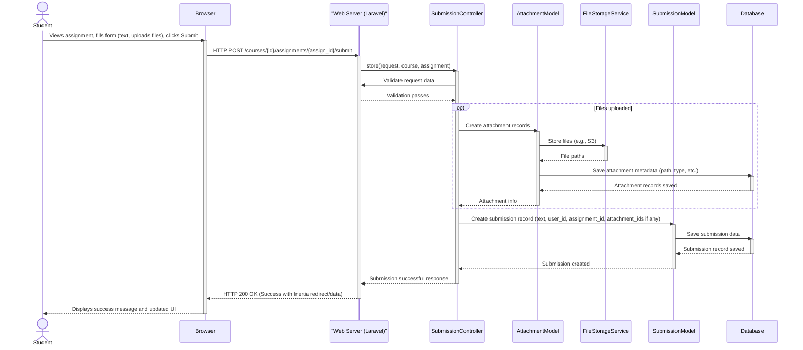
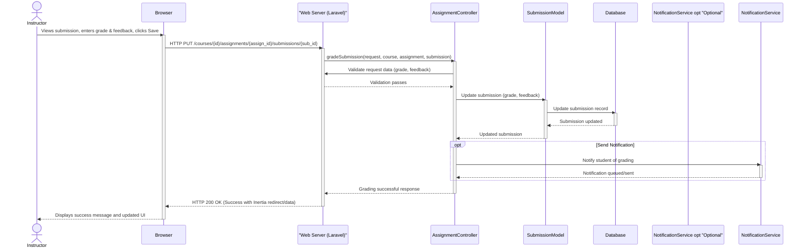

### Student Submits Assignment



### Instructor Grades Submission



### User Authentication (Login)

```mermaid
sequenceDiagram
    actor User
    participant Browser
    participant LaravelApp as "Web Server (Laravel)"
    participant LoginController
    participant UserModel
    participant SessionService
    participant Database

    User->>Browser: Enters email and password, clicks Login
    activate Browser
    Browser->>LaravelApp: HTTP POST /login
    activate LaravelApp
    LaravelApp->>LoginController: store(request)
    activate LoginController
    LoginController->>LaravelApp: Validate credentials format
    LaravelApp-->>LoginController: Validation passes
    LoginController->>Database: Attempt to authenticate user (check credentials against UserModel)
    activate Database
    Database-->>LoginController: Authentication success/failure
    deactivate Database
    alt Authentication Successful
        LoginController->>SessionService: Start/Regenerate session
        activate SessionService
        SessionService-->>LoginController: Session started
        deactivate SessionService
        LoginController-->>LaravelApp: Authentication successful, redirect to dashboard
        LaravelApp-->>Browser: HTTP 302 Redirect (to dashboard) with session cookie
        deactivate LoginController
        deactivate LaravelApp
        Browser->>LaravelApp: HTTP GET /dashboard (following redirect)
        activate LaravelApp
        LaravelApp-->>Browser: HTTP 200 OK (Dashboard page via Inertia)
        deactivate LaravelApp
        Browser-->>User: Displays Dashboard
    else Authentication Failed
        LoginController-->>LaravelApp: Authentication failed
        deactivate LoginController
        LaravelApp-->>Browser: HTTP 200 OK (Login page with error messages via Inertia)
        deactivate LaravelApp
        Browser-->>User: Displays login error message
    end
    deactivate Browser
```
